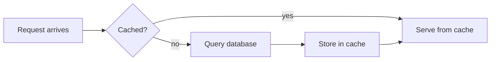
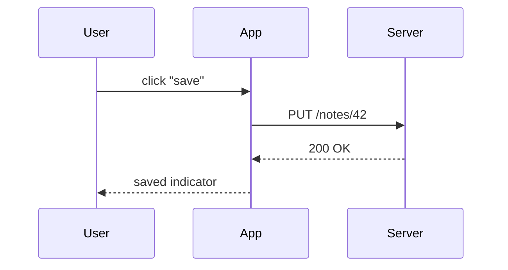
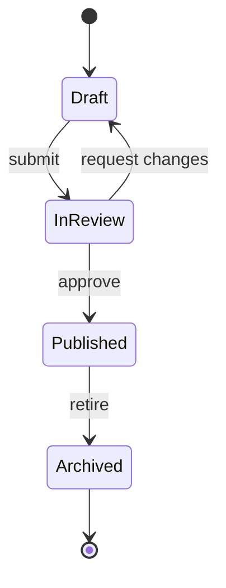
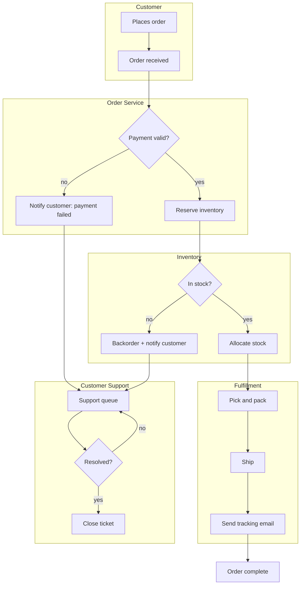

# diagrams with mermaid

Any fenced code block written as ` ```mermaid ` renders as a live diagram —
in the editor, in preview (`Ctrl+Shift+M`), and in published output (as a
static SVG, no script required by the reader). The source text underneath
never changes; if the diagram fails to parse you get a small error in its
place instead of a broken note.

This lesson builds up through the diagram types you'll actually reach for,
then ends with one deliberately larger model — the kind of thing a systems
analysis course asks students to read, argue with, and redraw.

## flowcharts

The default and most general type: nodes and directed edges.



`TD` (top-down) and `LR` (left-right) control the overall direction. Square
brackets `[ ]` are a process box, curly braces `{ }` a decision — label the
edges leaving a decision (`-- yes -->`) to say which branch is which.

## sequence diagrams

For "who talks to whom, in what order" — the natural shape for describing
an API call or a protocol.



Solid arrows are requests, dashed are responses — `->>` vs `-->>` — and
participants declared up top keep the swimlanes in a fixed, readable order
even if the messages themselves jump around.

## state diagrams

For "what states can a thing be in, and what moves it between them" — a
better fit than a flowchart whenever the subject is a single entity's
lifecycle rather than a process with a clear start and end.



## the systems model

Here's the payoff: an order-fulfillment system, four subsystems deep, with
a failure path that loops back into support instead of just dead-ending.
It's dense on first read — that's the point. Trace one path through it
(a happy order; a payment failure; an out-of-stock item) before trying to
take in the whole thing at once, and it stops feeling complicated.



A few things worth pointing students at, once they've read it once:

- **every path terminates.** Payment failure and out-of-stock both route
  into the same support queue rather than being separate dead ends —
  a deliberate design choice worth asking "why one queue and not two?"
  about.
- **the loop.** `M -- no --> L` is the only cycle in the diagram — a support
  ticket can stay unresolved indefinitely. Everything else is a strict
  progression. That asymmetry is usually where the interesting failure
  modes of a real system live.
- **subgraphs as team boundaries.** Each `subgraph` here maps naturally
  onto "which team owns this" — a common and useful way to read a systems
  diagram: not just what happens, but who's paged when it doesn't.

## try it

Copy the systems model into a scratch note and change something concrete:
add a "cancel order" path, split support into two queues, add a timeout
edge on the review loop above. Mermaid re-renders as you type — the
fastest way to find out whether a change to a system actually simplifies it
or just moves the complexity somewhere else.
